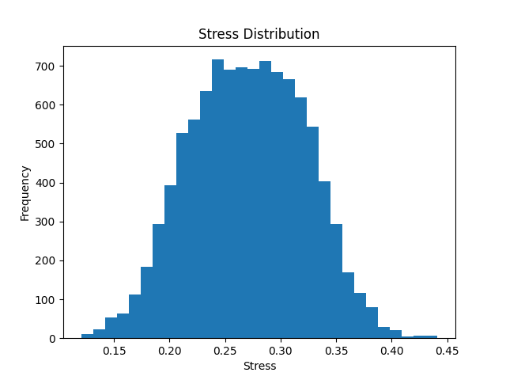
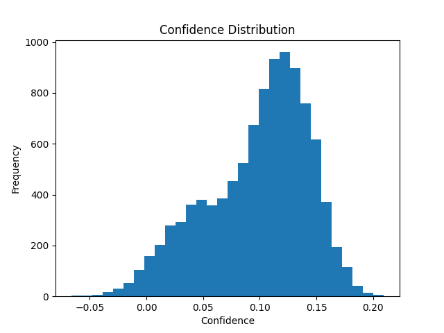
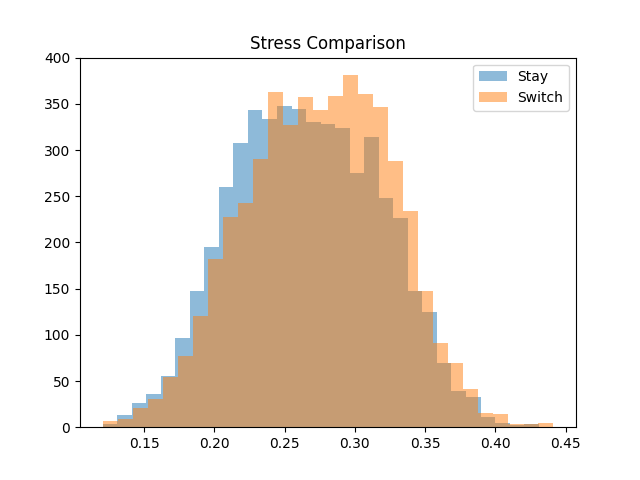

# BEHAVIOUR DETECTION

## Project Description

This project aims to understand the behaviour of a person using micro-expressions.
The goal is to observe whether a person stays committed to the statement they provided earlier or changes their response later.

This behaviour will be studied through a strategic game.
Game Scenario

Imagine you are playing a game where the objective is to maximize the reward.

Reward Rules

-If both players cooperate, each player receives 50% of the reward.
-If one player cooperates and the other betrays, the player who betrays receives 90% of the reward, the cooperating player receives 0%, and the house (the company organizing the game) receives 10%.
-If both players betray, both players receive 0%, and the house receives the entire 100% reward.

Rules / Process of the Game

-First, both players are asked to provide their answer in front of each other at the same time.
 Each player must choose either cooperate or betray.
-After this, the players are separated from each other.
-Each player is then asked to provide their final answer privately.

Objective of the Project

The purpose of this project is to determine whether a player will stay committed to their earlier statement or change their answer in the final round.

For example:

If both players choose cooperate in the first round, the question becomes:

Will both players remain committed to cooperation? Or will one of them change the answer and betray in the final decision?

Strategic Manipulation Condition

Before players provide their final answer in Round 2, they may receive a message such as:

“The other player has provided a different answer.”
This message may influence the player’s behaviour.

The project will analyze whether this information increases the likelihood that a player changes their response.

Behavioural Traits Observed

The system will attempt to understand the decision by analyzing three behavioural traits from micro-expressions.

Cunning
If the micro-expressions show signs of cunning or strategic deception, the player may switch their answer in the final round.

Honesty
If the person shows signals of honesty, they are more likely to stay committed to their earlier answer.

Confidence
If the person shows low confidence, they may be more likely to change their response in Round 2.

Final Goal of the System

The system must analyze the player’s facial micro-expressions and predict the player’s decision just before they reveal their final answer in Round 2.

The goal is to determine:
-whether the player will stay committed to their earlier answer, or change their decision at the last moment.

The project acquires data during Round 1 and Round 2, and the way the data is used unfolds in the following way.

-First, the data will be acquired in the time window of Round 1, the moment where the player makes the initial choice. In this brief moment the system observes the face carefully, trying to understand whether the player appears cunning, honest, or confident while giving the declaration.
-Second, the data will be taken again in the time window before making the Round 2 decision. At this stage the player stands alone with the decision, and the system observes the stress level and hesitation that may slowly appear.
-Third, the system studies the difference between Round 1 and Round 2, comparing the calm declaration with the tension that may grow before the final choice.
-Fourth, the model observes the final stance of Round 2, the last moment just before the player reveals the decision.

Finally, using these observations, the system applies probability to determine one crucial question — will the player stay with the original choice, or switch the answer at the final moment?

Psychological Signals Observed

During the interaction, the system quietly observes subtle movements of the face. Each expression carries a small psychological signal, revealing how the player may be feeling in the moment.

I am designing the system in such a way that it uses these facial factors because they may reflect meaningful psychological states during decision-making. However, this understanding is entirely based on my interpretation. It may or may not be fully accurate, but these assumptions are used as a working framework while gathering data and training the model.

Blink Rate
Rapid or irregular blinking may indicate hesitation or internal pressure.
A stable blink pattern may suggest calmness and confidence.

Brow Tension
Tightened eyebrows may indicate mental effort or stress.
Relaxed brows may suggest a composed state.

Lip Compression
Pressed lips may signal suppressed emotion or strategic tension.
Relaxed lips may indicate comfort.

Mouth Tension
A tightened mouth may reveal discomfort or hesitation.
A relaxed mouth may reflect ease and certainty.

Gaze Stability
A steady gaze may reflect confidence and commitment.
Frequent gaze shifts may indicate uncertainty.

Gaze Variance
Unstable eye movement may suggest hesitation or internal conflict.

Head Motion
Restless head movement may indicate nervousness or uncertainty, while a steady posture may suggest calmness.

Interpretation

The system observes these signals because they may capture the subtle psychological shifts that occur when a person moves from declaring a decision to revealing the final choice.

When facial behavior remains stable, it may reflect confidence or commitment.
When tension gradually appears—through blinking, tightening muscles, or shifting gaze—it may indicate stress, hesitation, or internal conflict.

These interpretations are not treated as absolute truths. They are assumptions used to guide the collection of data and the training of the model, allowing the system to explore how facial behavior may relate to strategic decisions.

Confidence

-blink_rate low
-gaze_stability high
-head_motion low
-brow_tension low
-mouth_tension low
-facial_expression stable

Honesty / Commitment

-blink_rate stable
-gaze_stability high
-stress_change low
-facial_expression consistent
-head_motion low

Cunning / Strategic Intent

-brow_tension high
-lip_compression high
-blink_variance high
-gaze_instability high
-mouth_tension high

Stress

-blink_rate high
-brow_tension high
-mouth_tension high
-lip_compression high
-head_motion increase

Hesitation / Uncertainty

-blink_variance high
-gaze_variance high
-head_motion high
-blink_spike_present
-mouth_tension high

Emotional Stability

-blink_rate stable
-gaze_stability high
-head_motion low
-brow_tension low
-mouth_tension low

Phase 1 — Round 1 Behavior (Declaration Window)

-blink_rate
-blink_variance
-brow_tension
-lip_compression
-mouth_tension
-gaze_stability
-gaze_variance
-head_motion
-facial_expression_stability

Measures:

-confidence
-honesty
-cunning

Phase 2 — Round 2 Dynamic Behavior (Decision Window)

-blink_rate
-blink_variance
-brow_tension
-lip_compression
-mouth_tension
-gaze_stability
-gaze_variance
-head_motion

Measures:

-stress
-hesitation
-confidence
-honesty
-cunning

Phase 3 — Round 2 Comparison with Round 1

-blink_rate
-blink_variance
-brow_tension
-lip_compression
-mouth_tension
-gaze_stability
-gaze_variance
-head_motion

Measures:

-stress
-hesitation
-uncertainty
-confidence

Phase 4 — Round 2 Final State

-blink_rate
-blink_variance
-brow_tension
-lip_compression
-mouth_tension
-gaze_stability
-gaze_variance
-head_motion

Measures:

-confidence
-honesty
-cunning
-stress

blink_rate

Measures how frequently a person blinks during a short time window.

How it is calculated

First, the openness of the eye is measured using the Eye Aspect Ratio (EAR).
EAR = eye_height / eye_width
When the eye closes, this ratio suddenly drops. Each drop below a threshold is counted as a blink.
The total blinks are then divided by the observation time.

blink_rate = number_of_blinks / time_window

This tells us how active the blinking behavior is during that moment.

blink_variance

Measures how stable or irregular the blinking pattern is.

How it is calculated

blink_variance = Σ(blink_rate − mean_blink_rate)² / n
If blinking changes suddenly or becomes irregular, this value increases.

brow_tension

Measures how tightly the eyebrows move toward the eyes.

How it is calculated

The distance between eyebrow landmarks and eye landmarks is measured.
brow_tension = √((x1 − x2)² + (y1 − y2)²)
When eyebrows tighten or lower, the distance decreases, indicating tension.

lip_compression

Measures how strongly the lips press together.

How it is calculated

Distance between the upper and lower lip points.
lip_compression = √((x1 − x2)² + (y1 − y2)²)
A smaller distance suggests the lips are pressed together.

mouth_tension

Measures tension in the mouth region.

How it is calculated

Distance between the corners of the mouth.
mouth_tension = √((x1 − x2)² + (y1 − y2)²)
Changes in this distance indicate tightening or strain around the mouth.

gaze_stability

Measures how steady the eye direction remains.

How it is calculated

gaze_stability = 1 / variance(gaze_direction)
If eye direction changes very little, stability is high.

gaze_variance

Measures how frequently the eyes shift direction.

How it is calculated

gaze_variance = Σ(gaze_direction − mean_direction)² / n
Higher values indicate more unstable eye movement.

head_motion

Measures how much the head moves between frames.

How it is calculated

head_motion = √((x_t − x_t−1)² + (y_t − y_t−1)²)
Large values mean the head is moving more frequently.

facial_expression_stability

Measures how stable the entire facial expression remains over time.

How it is calculated

facial_expression_stability = 1 / variance(all_landmark_positions)
If facial landmarks move very little, the expression is stable.

stress_mean

Represents the average stress-related signals observed in a time window.

How it is calculated

stress_mean = (x1 + x2 + ... + xn) / n
This gives the average level of stress indicators.

stress_variance

Measures how much the stress signals fluctuate.

How it is calculated

stress_variance = Σ(x − mean)² / n
Higher variance suggests emotional instability.

stress_slope

Measures whether stress increases as time progresses.

How it is calculated

stress_slope = (stress_last − stress_first) / time
If the slope is positive, stress is gradually rising.

Final Dataset Columns

The behavioral signals captured from the face become the following columns:

-blink_rate
-blink_variance
-brow_tension
-lip_compression
-mouth_tension
-gaze_stability
-gaze_variance
-head_motion
-facial_expression_stability
-stress_mean
-stress_variance
-stress_slope

Together, these numbers describe how the face behaves during the decision process, allowing the system to later estimate tendencies such as confidence, honesty, cunning, stress, and hesitation, and ultimately predict whether the player might change their decision.

In this system, the face is first translated into numbers. Those numbers are then gently combined to estimate the inner state of the player. Each trait emerges from a balance of signals.

Confidence

Confidence grows when the face remains steady and calm.

confidence =
(0.35 × gaze_stability)
− (0.25 × blink_rate)
− (0.20 × head_motion)
− (0.20 × mouth_tension)

Higher stability and lower movement increase the confidence score.

Honesty

Honesty appears when the face remains consistent and emotionally stable.

honesty =
(0.40 × facial_expression_stability)
+ (0.30 × gaze_stability)
− (0.20 × stress_variance)
− (0.10 × blink_variance)

Stable expressions and gaze strengthen the honesty score.

Cunning

Cunning emerges when subtle tension and calculation appear on the face.

cunning =
(0.35 × brow_tension)
+ (0.30 × lip_compression)
+ (0.20 × blink_variance)
+ (0.15 × gaze_variance)

Tension and irregular movements increase this score.

Stress

Stress rises when pressure begins to show through blinking and facial tension.

stress =
(0.30 × blink_rate)
+ (0.30 × brow_tension)
+ (0.20 × mouth_tension)
+ (0.20 × stress_slope)

Increasing signals suggest growing emotional pressure.

Hesitation

Hesitation appears when the face becomes unstable and uncertain.

hesitation =
(0.30 × blink_variance)
+ (0.30 × gaze_variance)
+ (0.20 × head_motion)
+ (0.20 × mouth_tension)

Irregular movement raises the hesitation score.

From Facial Signals to Decision Probability

The system observes the player’s face through four moments of the game. Each moment reveals a different part of the player’s behavior. Mathematics then brings these moments together to estimate whether the player will change the decision.

Phase 1 — Declaration

When the player gives the first answer, the face reveals the initial nature of the decision.
From the facial signals we calculate:

confidence_1

honesty_1

cunning_1

This phase captures how certain, sincere, or strategic the player appears at the beginning.

Phase 2 — Decision Window

As the player waits before revealing the final answer, pressure slowly builds.
The system observes the same facial signals and calculates:

confidence_2

honesty_2

cunning_2

stress_2

hesitation_2

This phase shows how the player behaves under growing tension.

Phase 3 — Behavioral Shift

Now the system compares the face between the first answer and the second round.
From this comparison we estimate:

confidence_3

stress_3

hesitation_3

This phase reveals whether the player’s behavior begins to change.

Phase 4 — Final Moment

Just before the final decision is revealed, the face often carries the strongest signal.
From this moment we calculate:

confidence_4

honesty_4

cunning_4

stress_4

This stage reflects the player’s final emotional state.

Combining the Phases

Each phase contributes a part of the story.
The system combines them into overall behavioral scores.

Example for confidence:

confidence_total
= 0.4 × confidence_1

0.2 × confidence_2

0.2 × confidence_3

0.2 × confidence_4

Similar totals are calculated for:

honesty_total

cunning_total

stress_total

hesitation_total

Final Probability

Finally, these traits are used to estimate the chance that the player changes the answer.

P(change)
= 1 / (1 + e^-(0.9 * cunning_total + 1.1 * stress_total + 0.8 * hesitation_total - 1.0 * confidence_total - 0.7 * honesty_total - 0.2))

-Not every behavioral trait influences a decision with the same strength, so weights are used to represent their relative impact during the decision process.

-Stress (1.1) is given slightly higher influence because emotional pressure can often trigger impulsive decision changes.

-Cunning (0.9) represents strategic thinking and calculated intent, which may increase the likelihood of switching decisions.

-Hesitation (0.8) reflects uncertainty and internal conflict, making a decision reversal more likely.

-Confidence (−1.0) acts as a stabilizing force, as confident players are more likely to stay committed to their original choice.

-Honesty (−0.7) reflects commitment to the initial statement, reducing the tendency to change the decision.

-The small bias term (−0.2) introduces a natural tendency for individuals to remain consistent rather than immediately switch their decision.

-Together, these elements model the tension between doubt and commitment at the final moment of the decision.

Disclaimer: The weights and relationships used in this model are hypothetical and included only for simulation within a fully synthetic dataset. They do not represent validated psychological measurements or real human behavioral parameters.

The result is a number between 0 and 1.

-closer to 1 → player likely changes the decision
-closer to 0 → player likely stays committed

The Idea

The first answer shows who the player appears to be.
The waiting period reveals how pressure grows.
The comparison exposes internal conflict.
And the final moment reveals true intent.

Mathematics simply gathers these signals and answers one question:

Will the player stay loyal to the first choice, or change the decision at the last moment?

## Synthetic Data Generation

Real human facial behavior data was not collected for this project.
Instead, the system simulates human decision behavior using probabilistic modeling.

When people make decisions under pressure, subtle facial signals often appear — blinking, gaze shifts, facial tension, or small head movements.
In this project, those signals are not captured from real faces, but are synthetically generated as numerical behavioral indicators.

The generator produces signals such as:

-blink_rate
-blink_variance
-brow_tension
-lip_compression
-mouth_tension
-gaze_stability
-gaze_variance
-head_motion
-facial_expression_stability
-stress_mean
-stress_variance
-stress_slope

These signals are generated using statistical distributions designed to approximate how facial behavior might vary during moments of strategic decision making.

Simulating Human Behavior

To avoid purely random data, several behavioral mechanisms are introduced to imitate human-like patterns.

Player Personality Types

Each simulated player begins with a behavioral tendency that influences how signals are generated.

Example personality profiles include:

-Honest – calm and stable signals, lower likelihood of switching decisions
-Strategic – subtle tension and calculated behavior
-Nervous – higher blinking, unstable gaze, and greater movement
-Confident – stable gaze and lower movement

These profiles create diversity in how players behave.

Hidden Emotional States

Behind the visible signals, the generator simulates internal states such as:

-Stress level
-Confidence level

These hidden variables influence multiple facial signals simultaneously.

For example:

Higher stress may increase blinking, facial tension, and gaze instability.
Higher confidence may stabilize gaze and reduce unnecessary movement.

This introduces correlated facial behavior instead of independent random values.

Temporal Decision Phases

Human behavior evolves during the decision process.
To capture this progression, the simulation models behavior across phases:

-Declaration – the moment when the initial decision is given
-Decision Window – the period of private reflection
-Behavioral Shift – the change between earlier and later behavior
-Final Moment – the last state before revealing the decision

Signals gradually drift between phases to simulate natural emotional change over time.

Stress Response Patterns

Players do not react to pressure in the same way.

The generator simulates different stress evolution patterns such as:

-stable emotional state
-gradually increasing stress
-decreasing stress as confidence grows
-early stress followed by stabilization
-sudden panic before the final decision

These patterns help produce varied human-like reactions.

From Signals to Behavioral Traits

Facial signals are transformed into higher-level behavioral traits:

-confidence
-honesty
-cunning
-stress
-hesitation

These traits represent simplified psychological states inferred from facial activity.

Decision Probability

The behavioral traits are combined to estimate the probability that a player changes their decision.

Traits such as stress, hesitation, and cunning increase the likelihood of switching.
Traits such as confidence and honesty reduce that likelihood.

A logistic probability model converts these behavioral influences into a probability between 0 and 1.

Human Unpredictability

Real human decisions are not always perfectly rational.

To simulate this unpredictability, the generator includes a small probability of random decision switching, representing situations where a player changes their decision without a clear behavioral signal.

Purpose of the Dataset

The generated dataset provides a controlled environment for experimenting with behavior-aware decision prediction models.

It allows exploration of how simulated facial signals and behavioral traits may relate to decision-making patterns in strategic scenarios.

Important Disclaimer

This dataset is fully synthetic.

No real human facial recordings, images, videos, biometric data, or facial expression datasets were used in the creation of this dataset.
All behavioral signals are artificially generated numerical values produced through probabilistic simulation.

The relationships between facial signals and psychological traits in this project are modeling assumptions created solely for experimentation.
They are not validated psychological measurements and should not be interpreted as scientifically proven indicators of human mental states.

The purpose of this dataset is to simulate behavioral patterns for experimentation with decision prediction models, not to replicate real human facial behavior or draw conclusions about real individuals.

## From Signals to Decisions

A brief moment. A silent hesitation. A choice.

This project explores how a person moves from an initial decision to a final one — and whether they stay committed or change under pressure.

### What This System Does
Simulates human-like behavioral signals (synthetic data)
Translates signals into traits like stress, confidence, hesitation, and intent
Observes behavior across multiple phases of a decision
Estimates the probability of switching
Uses machine learning to predict the final decision

Dataset

The system generates:

synthetic_behavior_dataset.csv

This dataset contains:

Behavioral signals (numerical form)
Derived psychological traits
Probability of change (P_change)
Final outcome (decision_change)

 Understanding the Data

Before prediction, the system studies the data:

Summary statistics ensure values are realistic
Distributions (histograms) reveal how behavior is spread
Comparisons (Stay vs Switch) show how traits differ

Example Visuals

[Confidence Comparison](Image/Confidence_Comparison.png)

These visuals help answer:

Do stressed or uncertain players behave differently from confident ones?

Core Idea

The system does not rely on certainty.

Instead, it models uncertainty —
where stress, confidence, and hesitation quietly compete before a decision is revealed.

 Disclaimer
This dataset is fully synthetic
No real human facial data is used
Behavioral interpretations are hypothetical
The system is designed for simulation and exploration only

One Line

Not a system that predicts decisions perfectly — but one that understands why they might change.

When Patterns Meet Uncertainty

The system has learned.
It has observed stress, confidence, hesitation —
and now it makes a choice.

## The Model

A Random Forest model studies the behavior of simulated players.

Not one rule, but many small decisions —
each tree looking at behavior from a slightly different angle.

Together, they attempt to answer:

Will the player stay… or change?

### Result
Accuracy ≈ 0.53

At first glance, it feels modest.

But this number reflects something deeper.

### What the Model Reveals

The confusion matrix shows a clear truth:

[[558 423]
 [511 508]]
Some decisions are correctly understood
Many exist in a grey zone
The model struggles where behavior overlaps

There is no clean boundary between certainty and doubt.

### Predictions in Motion

Each player is not just labeled — but interpreted:

Stay: 0.51 | Change: 0.49  
Predicted: Change → Correct  

Stay: 0.56 | Change: 0.43  
Predicted: Stay → Wrong  

The model does not guess blindly.
It hesitates — just like the player it observes.

 The Real Insight

Most probabilities lie close to:

0.45 – 0.55

A narrow band. A fragile balance.

Where:

confidence is not strong enough
stress is not decisive enough

And the outcome could go either way.

### Meaning

This is not a system of certainty.

It is a system of tension —
where multiple signals compete before a decision emerges.

### Understanding the Accuracy

A higher accuracy would imply:

Human behavior is easily predictable

But this system shows otherwise:

Even with all signals captured, decisions remain uncertain.

### One Line

The model does not fail — it reflects the reality that human decisions are rarely absolute.